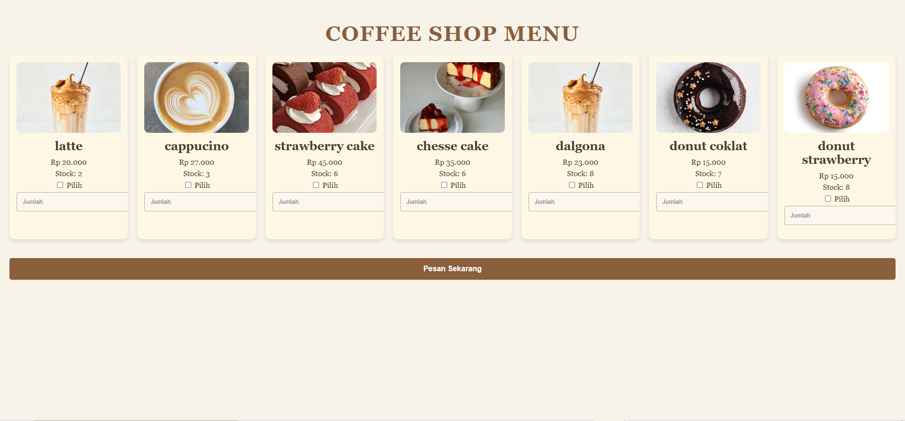
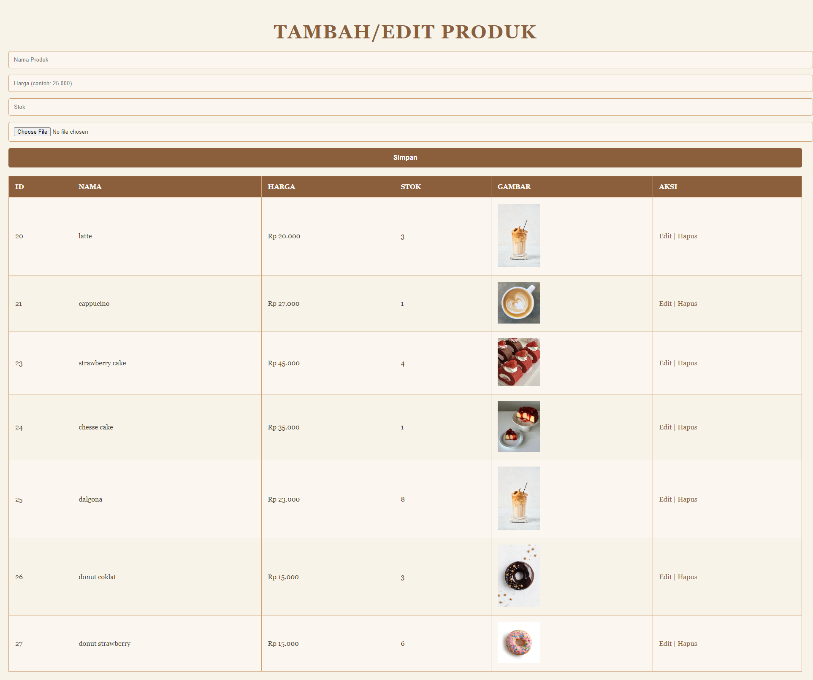

# Coffee Shop Ordering System

## Deskripsi
Aplikasi ini adalah sistem pemesanan sederhana untuk kedai kopi. Pengguna dapat melihat daftar menu, memilih produk, dan melakukan pemesanan. Sistem ini terhubung dengan database untuk menyimpan informasi tentang produk, pelanggan, dan pesanan.

## Fitur Utama
- **Lihat Daftar Menu**: Pengguna dapat melihat semua produk yang tersedia beserta gambar, harga, dan jumlah stok.
- **Pemesanan**: Pengguna dapat memilih satu produk dan memasukkan jumlah yang ingin dipesan.
- **Manajemen Stok**: Stok produk akan otomatis terkurangi setelah pemesanan berhasil.

## Teknologi yang Digunakan
- **Bahasa Pemrograman**: PHP
- **Database**: MySQL
- **HTML/CSS**: Untuk tampilan antarmuka pengguna

